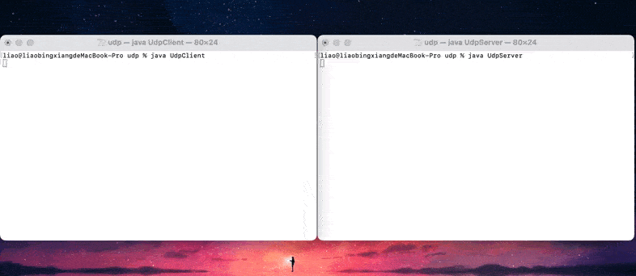

# 应用层

> 应用层无论在OSI几层协议模型、常用的五层模型以及TCP/IP四层协议中，都属于最高层。<br>
>
> 而我们Web开发与该层的HTTP协议密不可分，所以面试中需要注意着重注意这一层的常见协议。<br>


## HTTP（HyperText Transfer Protocol，超文本传输协议）

> 现代Web是构建与HTTP协议之上的，可以说没有HTTP就没有Web，我们常用的手机、电脑等设备中存在大量的HTTP交互。因此理解了HTTP协议中相关信息，理解网络编程就会十分轻松。


- HTTP采用***TCP***作为它的运输支撑协议。（而不是UDP，因为TCP是可靠的连接传输）

- HTTP是一个**无状态协议**（stateless protocol）。

  > 所谓无状态是指：服务器不维护任何有关客户端过去发送的请求（即HTTP服务器并不保存任何有关客户端过去发送的信息）。

- 非持续性连接和持续性连接

  > Web常采用C/S架构（客户 - 服务器），期间存在大量的响应和请求（Response / Request）。<br>
  >
  > 如果每个请求和响应都***单独***采用一个TCP连接进行，则称为非持续性连接。<br>
  >
  > 如果每个请求响应都采用***同一个***TCP连接进行，则称为持续性连接。<br>
  >
  > <br>
  >
  > 非持续连接存在以下两个缺点：
  >
  > 1. 消耗大量资源。非持续连接会频繁创建和断开TCP连接，而Web常采用C/S架构，会造成大量的资源的消耗。高并发下可能会使服务器宕机。
  > 2. 耗费大量时间。TCP三次握手与四次挥手，会造成大量的时间浪费。可能大部分等待时间都是都是在TCP的连接与释放。 
  >
  > <br>
  >
  > HTTP1.0  默认使用短连接  HTTP1.1默认使用长连接。


### 请求报文和响应报文

Request

```http
GET /somedir/page.html HTTP/1.1
Host: www.someschool.edu
Connection: close
User-agent: Mozilla/5.0
Accept-language: fr
```

HTTP请求由：**请求行、请求头、空行、请求体（非必须）**

> 无论是否有请求体，request都必须以空行结尾。

- 请求行由请求方法、URL、HTTP版本构成。
- 请求头则是由key - value 键值对组成，表示各种含义。可以自行在请求中添加请求头。
- 空行，则用于区分请求头和请求体。
- 请求体中包含请求需要的各种数据。一般GET请求的请求体为空。

Response

``` http
HTTP/1.1 200 OK
Connection: close
Date: Tue, 18 Aug 2015 15:44:04 GMT
Content-Length: 6821
Content-type: text/html

(data  data data ...)
```

HTTP响应由：**响应行、响应头、空行、响应体**

- 响应行由HTTP版本、状态码、解释（非必须）
- 响应头由key - value 键值对组成，表示各种含义。
- 空行，则用于区分响应头和响应体。

#### 常见的响应状态码和请求方法

- GET、POST、PUT、DELETE
- 1xx 之前的请求没有问题，请求继续；
- 2xx 请求成功；
- 3xx 请求重定向；
- 401 未认证，没有登录； 404 not found； 403 没有权限；
- 5xx 服务器错误；

### Cookie

> 记录用户的状态和活动（如：是否登录？购物车？浏览了哪些网页？）

cookie 的四个组件

- 在HTTP响应报文中有一个cookie首部行
- 在HTTP请求报文中有一个cookie首部行
- 在用户端系统中保留有一个cookie文件，并由用户浏览器进行管理
- 位于Web站点的一个后端数据库（Session、Redis 可以存储cookie和对应的信息）

### Web缓存器（代理服务器）

原理如下：

- 加入一个局域网（如学校，小区）都向外部请求一个资源，那么对于此局域网通向外部的带宽要求非常高
- 但加入Web缓存器，请求到达Web缓存器后，会先在本地查看是否有对应请求的缓存，有就直接返回，从而减少了局域网对外部请求的贷款要求，从而减少了带宽要求

存在问题：**代理服务器缓存的对象可能是旧版。**

解决办法：***条件GET***

> 即缓存服务器，向目标服务器发送条件Get（此请求与客户端向目标服务器发送请求相同，只不过携带了浏览器缓存的对象的Last-Modified时间）

```http
GET /fruit/kiwi.gif HTTP/1.1
Host: www.test.com
If-modified-since: Wedd, 9 sep 2015 09:23:24 #浏览器缓存的数据，上次修改时间
```

> 此时资源服务器收到请求，如果条件GET发送的时间，与服务器本地文件修改时间是一样的，那么资源服务器就不会传输该对象，而是返回一个 empty entity body的304报文，从而节约了文件的传输成本和带宽，也降低了传输时延，提高了用户体验。

```http
HTTP/1.1 304 Modified
Date: sat, 10 Oct 2015 15:39:29
Server: Apache/1.3.0 (Unix)

(empty entity body)
```


---


## 电子邮件相关协议（SMTP、POP3、IMAP、HTTP）

注意点：

- HTTP属于**拉协议（pull Protocol）**，而SMTP属于**推协议（push Protocol）**

> 拉协议：当client需要信息的时候，是从服务器中拉取信息。
>
> 推协议：即发送邮件的服务器把文件推向邮件接收服务器

- SMTP的报文**必须采用7比特的ASCII码形式**（如果存在二进制文件，也需要转化为ASCII）
- HTTP对于大对象，会把信息放在多个报文中传输，而SMTP则是把所有报文对象放在一个报文里面。
- 文件传输的流程和使用的协议如下图：


- POP3协议只能将邮件服务器中的邮件下载到本地，而不能对服务器上的下达创建文件夹或者将邮件放在服务器的某个文件夹中的命令，而IMAP和HTTP则能够实现。
- 需要注意，倘若在浏览器发送和接受文件，那么使用的一定是HTTP协议。
- 邮件传递不会经过中间服务器，及时Alice和Bob的服务器分别位于地球的两段邮件传输，也是直接在两台服务器之间建立TCP连接。

---


## DNS

> 将其他用户提供的主机名解析为IP地址。

DNS提供的功能：

1. 主机名-IP地址转化

   > DNS域名解析： www.google.com  ---> 127.1.1.1

2. 主机别名（即多个域名可以映射到同一个IP上）

   >多个域名映射到同一个IP上
   >
   >www.lbx.com --> 127.1.1.1
   >
   >www.superlbx.com --> 127.1.1.1

3. 邮件服务器别名

   > lbx@yahoo.com  --> www.yahoo.com
   >
   > 因为有的域名可能很长，所以 DNS可以将域名简化@qq.com或者@gmail.com这种方便记忆的形式

4. 负载分配

   > 一个域名可能对应多个IP（如www.lbx.com  可能对应了 192.168.2.1、192.168.2.2、192.168.2.3多个IP地址，这在分布式系统中很常见 ），DNS服务器中存在这个这些IP集合，当Client查询的时候，DNS Server会**交换次序**返回IP集合，因为客户端总是向IP地址集合最前面的IP发送消息请求。从而达到DNS负载分配。

---

- DNS采用分布式、层次数据库。

  > 分布式是指：全球存在很多的DNS解析服务器。
  >
  > 层次是指：将DNS服务器分为不同的级别，从而方便实现查询

- DNS被分为：**根DNS服务器（.）、顶级域DNS服务器(com, org, edu)、权威DNS服务器(google.com)**

- DNS的查询方式分**递归查询** 和**迭代查询**两种方式。

  > 递归查询：以自己的名义请求DNS并返回获得映射，本机只请求一次，剩下的交给上级DNS去做。
  >
  > 迭代查询：请求DNS根服务器后，根DNS返回下一个DNS服务器地址，本机继续请求其他DNS服务器，只到找到域名IP映射。

  >
  >
  >平时的查询方式： 请求主机到本地DNS服务器查询是递归的，其余的DNS查询则是迭代的。

  

---

DNS缓存(DNS caching)：

> 改善传输时延，减少DNS的报文数

- DNS将在一段时间（通常是两天）将丢弃缓存信息
- 在DNS请求链中，当某个DNS服务器接收一个DNS回答时，他能将映射缓存在本地的存储器中。
- 如果在DNS缓存中，缓存了一台主机名/IP地址对，另一个对相同主机名的查询到达该DNS服务器时，该DNS能够提供所需要的IP地址，及时他不是该主机名的权威服务器。

---

DNS记录：

- 资源记录是包含以下字段的四元组

  - (Name, Value, Type, TTL)

- 其中Type有四种类型：A、NS、CNAME、MX

  - 如果Type=A，则Name是主机名，Value是该主机名对应的IP地址

    > （bytedance.com,  127.0.0.1, A）

  - s如果Type=NS，则Name是个域（bytedance.com）,而Value是个知道如何获取该域中主机IP地址的权威DNS服务器的主机名。

    > (bytedance.com, dns.bytedance.com, NS)

  - 如果Type=MX，则Value是个别名为Name的邮件服务器的规范主机名。

    > (foxmail.com, mail.bar.foxmail.com. MX)

  - 如果Type=CNAME，则Value是别名为Name的邮件服务器的规范主机名。

    > (bytedance.com, relay1.bar.foo.com, CNAME)

---

## 套接字（Socket）

> Sockst用于应用层和运输层之间的通信


---

### Java UDP 实现socket通信

Title：

1. 客户使用键盘读取一行字符（数据）并将该数据向服务器发送。
2. 服务器接收该数据并将这些字符转换为大写。
3. 服务器将修改的数据发送给客户。
4. 客户接受修改的数据并在其监视器上，将该行现实出来。

[参考链接](http://c.biancheng.net/view/1203.html)

一般我们设计一个程序或者实现一个功能，先要去了解他的API，然后根据API去设计。

> 先分析题目（功能），我们需要了解Java字符流处理的相关API，其次还需要了解Java UDP通信相关的API。<br>流主要用于，字符的读取（从键盘中读取）和处理（将字符转化为流并发送，或将流转化为字符）。<br>UPD Socket 主要用于信息的发送和接收。

**我们一步一步的实现这个功能**

1. 设计发送的基础架构

```java
/**
 * 通过 DatagramSocket 和 DatagramPacket 发送数据报。
 * DatagramSocket : 相当于一个主体，用于设置ip:port 控制 send 和 receive.
 * DatagramPacket : 相当于一个包，用于承载我们想要发送的内容，如字符流。
 * InetAddress : 构建一个ip地址
 */
public void sendMsg() throws IOException {

    // 构造 socket 工具，用于 send 和 receive 需要注意的是由于我们每个包都有对应的 ip address 和 port
    // 所以指定 ip : port 应该放在 datagramPacket
    DatagramSocket datagramSocket = new DatagramSocket();

    // 需要发送的数据
    byte[] bytes = new byte[0];

    // 构建需要发送的 packet，需要指定发送的数据，发送的地址， 发送的端口号
    // 发送的数据： 为 byte 数组，第二个参数指定长度
    // 构造ip地址，这里可以调用 InetAddress 提供的根据域名发送获取 ip 地址，
    // 也可以直接指定ip，在InetAddress.getName()存在判断是否是ip 地址的段落
    // ======================================================================
    // if host is an IP address, we won't do further lookup
    // if (Character.digit(host.charAt(0), 16) != -1 || (host.charAt(0) == ':')) 
    // ======================================================================
    // 最后一个参数指定 port
    DatagramPacket datagramPacket = new DatagramPacket(bytes,  bytes.length, InetAddress.getByName("localhost"), 8848);

    //发送
    datagramSocket.send(datagramPacket);
}
```

当然，现在是无法实现发送我们的输入到指定客户端。

2. 设计一个接收用户报的基础架构

```java
/**
 * 监听并接收数据
 */
public void receive() throws IOException {

    // 创建 socket 工具，并指定本地监听端口，也可以本地的 ip 地址
    DatagramSocket datagramSocket = new DatagramSocket(8849);

    // 定义一个byte[] 数组用于接收和存储数据
    byte[] received = new byte[1024];
    //构建 packet 是 socket 能够使用接收数据
    DatagramPacket datagramPacket = new DatagramPacket(received, received.length);

    // socket接收数据，并将数据存储到packet构建时指定的byte数组
    datagramSocket.receive(datagramPacket);

    //用户传递的数据
    byte[] datagramPacketData = datagramPacket.getData();
}
```


> 至此，UDP接受和发送数据的步骤和核心代码已经实现，接下来，是根据题目（需求），进一步完善

---

发送存在的问题：

	1. 无法实现键盘输入。
	2. 无法循环发送数据。

接收存在的问题：

1. 无法做到随时监听。
2. 无法展示数据。


解决办法：

​	对于键盘输入，引入Java I/O 流工具即可，Java在这一方面的支持很好。

​	对于循环发送数据和试试监听，直接采用循环。

---

问题和解决办法已经有思路了，接下来开始实现：

```java
    /**
     * 通过 DatagramSocket 和 DatagramPacket 发送数据报。
     * DatagramSocket : 相当于一个主体，用于设置ip:port 控制 send 和 receive.
     * DatagramPacket : 相当于一个包，用于承载我们想要发送的内容，如字符流。
     * InetAddress : 构建一个ip地址
     */
    public void sendMsg() throws IOException {
        
        // 构造 socket 工具，用于 send 和 receive 需要注意的是由于我们每个包都有对应的 ip address 和 port
        // 所以指定 ip : port 应该放在 datagramPacket
        DatagramSocket datagramSocket = new DatagramSocket();

        BufferedReader bufferedReader = new BufferedReader(new InputStreamReader(System.in));
        String line = null;

        //循环发送
        while (null != (line = bufferedReader.readLine())) {

            //设置终止条件
            if("quit".equals(line)) {
                break;
            }

            // 需要发送的数据，直接从键盘输入读取
            byte[] bytes = line.getBytes(StandardCharsets.UTF_8);

            // 构建需要发送的 packet，需要指定发送的数据，发送的地址， 发送的端口号
            // 发送的数据： 为 byte 数组，第二个参数指定长度
            // 构造ip地址，这里可以调用 InetAddress 提供的根据域名发送获取 ip 地址，
            // 也可以直接指定ip，在InetAddress.getName()存在判断是否是ip 地址的段落
            // ======================================================================
            // if host is an IP address, we won't do further lookup
            // if (Character.digit(host.charAt(0), 16) != -1 || (host.charAt(0) == ':'))
            // ======================================================================
            // 最后一个参数指定 port
            DatagramPacket datagramPacket = new DatagramPacket(bytes,  bytes.length, InetAddress.getByName("localhost"), 8848);

            //发送
            datagramSocket.send(datagramPacket);
        }
    }

    /**
     * 监听并接收数据
     */
    public void receive() throws IOException {

        // 创建 socket 工具，并指定本地监听端口，也可以本地的 ip 地址
        DatagramSocket datagramSocket = new DatagramSocket(8849);

        // 循环实现一直监听，还得涉及到多线程，实现send() 和 receive() 同步进行
        while (true) {

            // 定义一个byte[] 数组用于接收和存储数据
            byte[] received = new byte[1024];

            //构建 packet 是 socket 能够使用接收数据
            DatagramPacket datagramPacket = new DatagramPacket(received, received.length);

            // socket接收数据，并将数据存储到packet构建时指定的byte数组
            datagramSocket.receive(datagramPacket);

            //用户传递的数据
            InetAddress address = datagramPacket.getAddress();
            String data = new String(datagramPacket.getData());
            int port = datagramPacket.getPort();

            System.out.println("发送的地址为：" + address.toString() +
                    "\n接受的端口号为：" + port +
                    "\n发送的内容：" + data);

            //设置终止条件
            if ("bye~".equals(data)) {
                return;
            }
        }
    }
```


其实client/server本质上都是接收和发送socket包，所以我们可以把address和port抽取出来，作为参数传入，把send() 和 receive() 方法封装为util.

==***UdpSocketUtil.java***==

```java
package udp;

import java.io.BufferedReader;
import java.io.IOException;
import java.io.InputStreamReader;
import java.net.*;
import java.nio.charset.StandardCharsets;
import java.util.Arrays;

/**
 * @Author: bingxiang
 * @Date: 2021/06/05/2:54 下午
 * @Description:
 */
public class UdpSocketUtil {

    /**
     * 通过 DatagramSocket 和 DatagramPacket 发送数据报。
     * DatagramSocket : 相当于一个主体，用于设置ip:port 控制 send 和 receive.
     * DatagramPacket : 相当于一个包，用于承载我们想要发送的内容，如字符流。
     * InetAddress : 构建一个ip地址
     */
    public static void sendMsg(String address, Integer sendPort) {

        try {
            // 构造 socket 工具，用于 send 和 receive 需要注意的是由于我们每个包都有对应的 ip address 和 port
            // 所以指定 ip : port 应该放在 datagramPacket
            DatagramSocket datagramSocket = new DatagramSocket();

            BufferedReader bufferedReader = new BufferedReader(new InputStreamReader(System.in));
            String line = null;

            //循环发送
            while (null != (line = bufferedReader.readLine())) {

                //设置终止条件
                if("quit".equals(line)) {
                    break;
                }

                // 需要发送的数据，直接从键盘输入读取
                byte[] bytes = line.getBytes(StandardCharsets.UTF_8);

                // 构建需要发送的 packet，需要指定发送的数据，发送的地址， 发送的端口号
                // 发送的数据： 为 byte 数组，第二个参数指定长度
                // 构造ip地址，这里可以调用 InetAddress 提供的根据域名发送获取 ip 地址，
                // 也可以直接指定ip，在InetAddress.getName()存在判断是否是ip 地址的段落
                // ======================================================================
                // if host is an IP address, we won't do further lookup
                // if (Character.digit(host.charAt(0), 16) != -1 || (host.charAt(0) == ':'))
                // ======================================================================
                // 最后一个参数指定 port
                DatagramPacket datagramPacket = new DatagramPacket(bytes,  bytes.length, InetAddress.getByName(address), sendPort);

                //发送
                datagramSocket.send(datagramPacket);
            }
        } catch (IOException e) {
            e.printStackTrace();
        }
    }

    /**
     * 监听并接收数据
     */
    public static void receive(Integer monitorPort) {

        try {
            // 创建 socket 工具，并指定本地监听端口，也可以本地的 ip 地址
            DatagramSocket datagramSocket = new DatagramSocket(monitorPort);

            // 循环实现一直监听，还得涉及到多线程，实现send() 和 receive() 同步进行
            while (true) {

                // 定义一个byte[] 数组用于接收和存储数据
                byte[] received = new byte[1024];

                //构建 packet 是 socket 能够使用接收数据
                DatagramPacket datagramPacket = new DatagramPacket(received, received.length);

                // socket接收数据，并将数据存储到packet构建时指定的byte数组
                datagramSocket.receive(datagramPacket);

                //用户传递的数据
                InetAddress address = datagramPacket.getAddress();
                String data = new String(datagramPacket.getData(), 0, datagramPacket.getLength());
                int port = datagramPacket.getPort();

                System.out.println("发送的地址为：" + address.toString() +
                        "\n接受的端口号为：" + port +
                        "\n发送的内容：" + data);

                //设置终止条件
                if ("bye~".equals(data)) {
                    return;
                }
            }
        } catch (IOException e) {
            e.printStackTrace();
        }
    }

}

```

---

接下来使用多线程的方式，使一个main方法，开启两个线程，并且将代码抽取出来：

==***UdpClient.java***==

```java
public class UdpClient {
    public static void main(String[] args) {

        // 开启线程并执行，必须在sendMsg之前，否则会一直在sendMsg中，不会继续执行下去
        new Thread(() -> {
                UdpSocketUtil.receive(8849);
        }).start();

        //进入循环
        UdpSocketUtil.sendMsg("localhost", 8848 );
    }
}
```
==***UdpServer.java***==

```java
public class UdpServer {
    public static void main(String[] args) {

        // 开启线程并执行，必须在sendMsg之前，否则会一直在sendMsg中，不会继续执行下去
        new Thread(() -> {
            UdpSocketUtil.receive(8848);
        }).start();

        //进入循环
        UdpSocketUtil.sendMsg("localhost", 8849 );
    }
}
```

> 可以看到代码简化了很多，并且UdpSocketUtil还能被其他的类作为工具使用，好处多多

查看实际的效果：

首先同时编译多个Java文件的命令：

```shell
javac -d . UdpClient.java UdpSocketUtil.java
```

然后实现消息的发送：




